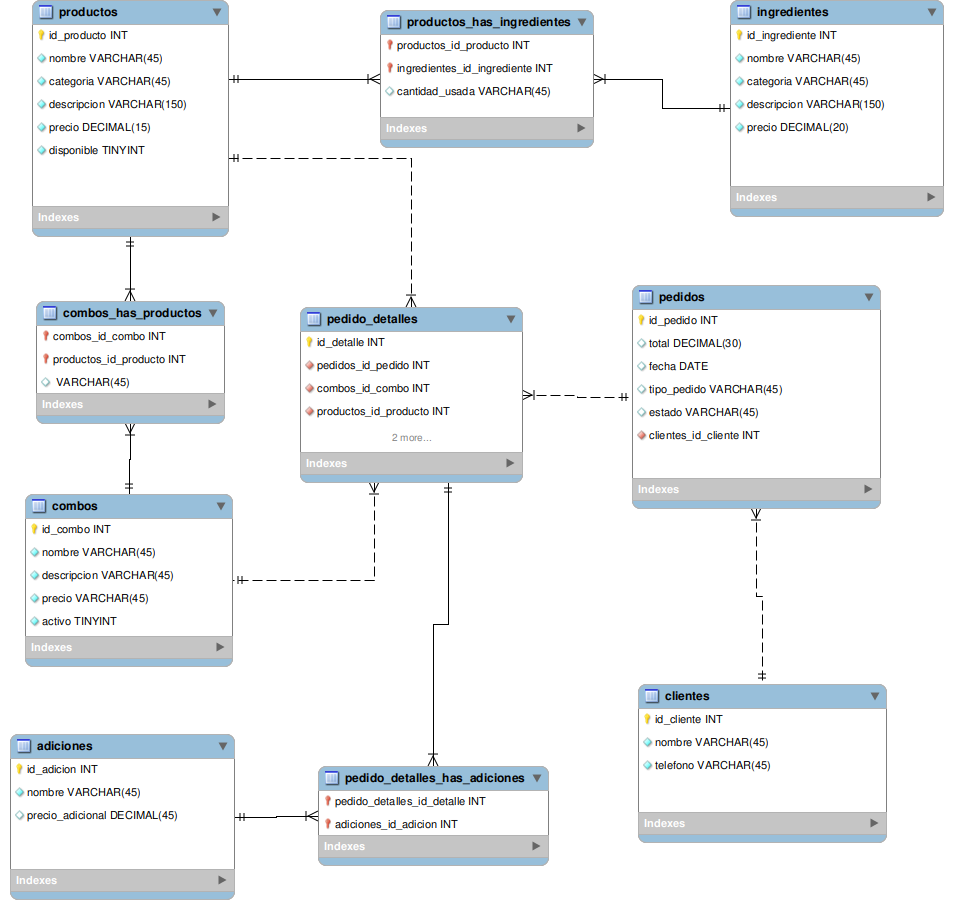

Base de Datos de Academia

## Introducción

Este trabajo tiene como objetivo principal representar la base de datos que vamos a estar trabajando para el proyecto de la aplicación que estamos desarrollando. Como siempre me gusta enfoccarme en la escabilidad de un proyecto, pensando a futuro en el tipo de reportería que podría exigirse de un establecimiento educativo tomé en cuenta los campos que presenté a continuación.

## Diseño de la Base de Datos

En el diseo de base de datos podemos encontrar la relación de productos a ingredientes de muchos a muchos, hizo falta una tabla intermedia para poder acomodar la relación de los productos

### Justificación del Diseño

Productos más vendidos (pizza, panzarottis, bebidas, etc.)
Total de ingresos generados por cada combo
Pedidos realizados para recoger vs. comer en la pizzería
Adiciones más solicitadas en pedidos personalizados
Cantidad total de productos vendidos por categoría
Promedio de pizzas pedidas por cliente
Total de ventas por día de la semana